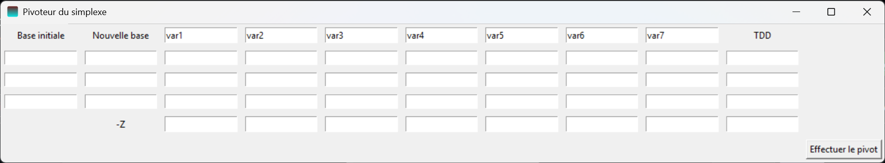

# PivoteurSimplexe

Pivoteur du simplexe est une application qui permet d'effectuer des opérations de pivot d'un tableau du simplexe, une étape à la fois.

## Description

Cette application a été conçue pour assister les enseignants et étudiants qui utilisent la méthode du simplexe pour résoudre des problèmes d'optimisation linéaire. Elle permet d'effectuer les changements de base sans avoir à effectuer les calculs soit-même pour éviter les risques de faire des erreurs de calcul.

### Installer

Télécharger l'[installateur Windows](https://github.com/SuperJujube987/PivoteurSimplexe/releases/download/v1.1.0/InstallPivoteurSimplexe.exe).

## Utilisation

En lançant l'application, vous allez voir cette fenêtre:

Faites attention, fermer cette fenêtre ferme l'application entière.

### Changement de base

Choisir l'option "Effectuer un pivot" de la liste déroulante présente dans la fenêtre initiale. Vous allez voir cette fenêtre:

Vous pouvez entrer manuellement le nombre de variables et de contraintes présentes dans votre problème, ou utiliser les flèches pour incrémenter/décrémenter les nombres directement. Les deux sont limités à 10, donc cette application ne peut effectuer un changement de base pour un problème contenant plus de 10 variables ou contraintes.

Après avoir entré la taille du problème, vous allez voir cette fenêtre:

Vous pouvez maintenant entrer les données de votre problème, en nommant les variables selon votre préférence. Notez bien qu'il faut utiliser le nom des variables entrés dans les colonnes des bases. Notez bien aussi que le tableau du simplexe doit être rempli de manière à respecter les conditions pour que le problème soit sous forme canonique, c'est-à-dire les colonnes associées à la base initiale forment une matrice identité, les termes dans la ligne "-Z" associés aux variables de la base initiale doivent être nuls et les colonnes associées à la nouvelle base forment une matrice inversible.

Voici un exemple:

Après avoir entré les données du problème, vous pouvez effectuer le pivot. Si le problème n'est pas sous forme canonique, ou si un autre problème est survenu, il y aura une fenêtre l'indiquant. Si tout est correct, vous allez voir une fenêtre comme celle-ci indiquant le tableau associé à la nouvelle base:

### Normalisation de problème

Cette fonctionnalité n'est pas encore implémentée.

## Notes supplémentaires

L'application a été conçue de manière à permettre d'utiliser la méthode du grand M, car elle effectue des calculs symboliques.

De plus, vous pouvez entrer des fractions dans le tableau.

Également, vous pouvez utiliser le tableau initial pour faire plusieurs changements de base, pas besoin de changer tout le tableau à chaque pivot.

Cependant, il n'y a pas moyen d'utiliser des nombres irrationnels.

## Auteur

Julien Houle

[Julien.Houle@USherbrooke.ca](mailto:Julien.Houle@USherbrooke.ca)

## Historique de versions

* 1.1
  * Ajustement de l'interface.
* 1.0
  * Version initiale.
